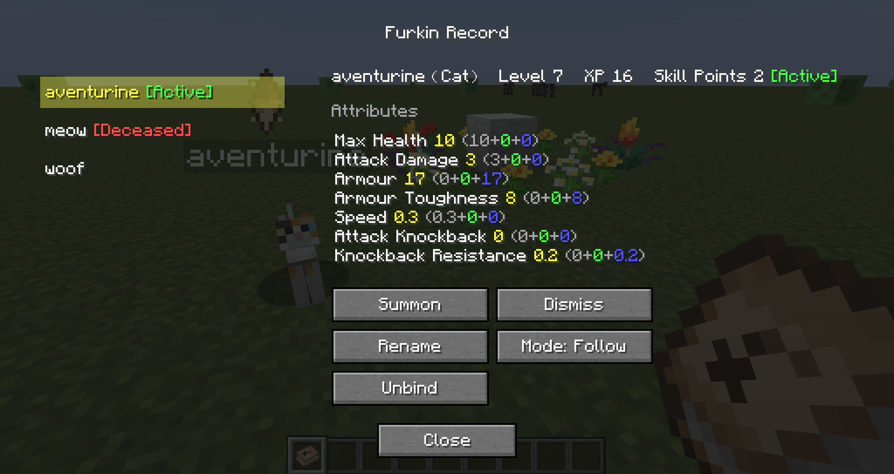
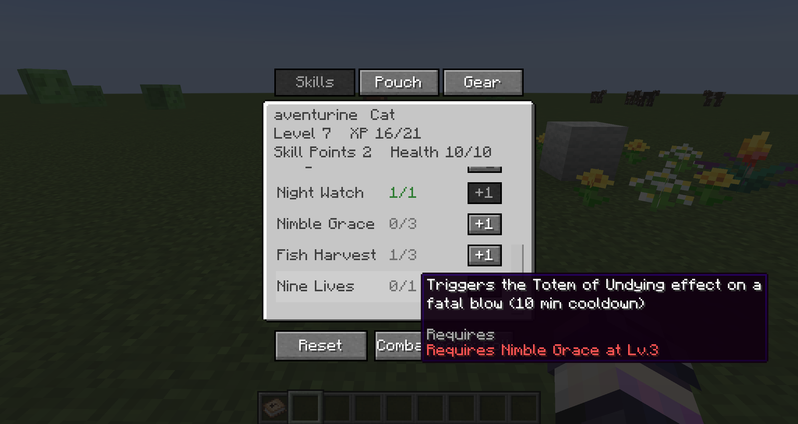

# Furkin


A lightweight **companion pet framework** for Minecraft Forge. Contract vanilla animals into
growing, skill-tree'd, equippable, revivable companions — and expose a public API so other mods
can bring their own creatures in as companions too. Native support for cats and dogs is
included (because they're rather fluff~y~).

> 中文说明见 [README.zh-CN.md](./README.zh-CN.md)。

---

## Features

- **Contract** — turn any registered species into a companion with a single item, no prior taming required. Enemy, neutral and other targets have configurable health gates.
- **Skill tree** — a shared trunk plus species-specific branches.
- **Equipment** — companions wear vanilla armor (all 4 slots), third-party armor works with zero config.
- **Travel pouch** — a carry-along inventory that grows with the `travel_pouch` skill level, with shrinking, reclaiming and death-drop handling built in. Finally, someone else carries the cobblestone.
- **Revival** — a soulstone-based revive system that preserves all growth.

## Contract Health Gates

Contracting is checked when the naming request starts and again when it is confirmed:

| Target class | Default gate |
|---|---|
| `Enemy` | At or below `30%`, or at or below `4` health |
| `NeutralMob` | At or below `30%`, or at or below `4` health |
| Other registered species | Full health allowed (`100%`; absolute branch disabled) |

The six values live in the server config (`contractEnemyHealthPercent` / `contractEnemyHealthAbsolute`,
`contractNeutralHealthPercent` / `contractNeutralHealthAbsolute`,
`contractOtherHealthPercent` / `contractOtherHealthAbsolute`). Either the percentage branch or the
absolute branch may pass. Setting an absolute value to `0` disables that branch; setting a percentage
to `100` disables the percentage limit for that class.

Only species registered with Furkin can enter this check. Non-`TamableAnimal` enemies are currently
supported for archive, dismiss and resummon flows, but not for full follow/ceasefire/aggressive AI.
## Dependencies

| Requirement     | Version |
| --------------- | ------- |
| Minecraft       | 1.20.1  |
| Minecraft Forge | 47.0+   |

**Zero hard dependencies.** No required library mods.

## Installation

1. Install [Minecraft Forge 1.20.1](https://files.minecraftforge.net) (47.0 or later).
2. Download the latest `.jar` from the releases.
3. Drop it into your `.minecraft/mods` folder.

## Usage

- Craft a **Furkin Contract** from wool and paper, then right-click any valid animal to bond it as a companion.
- Craft a **Furkin Record** from a Furkin Contract and a book to manage your companions
  (summon, recall, unbind, toggle combat mode, and more).



- When unbinding, the companion's pouch and equipment drop at its current position, and its displaced AI and vanilla default drop chances are restored. If a summoned companion cannot be resolved, the Furkin Record offers a confirmed force-unbind; cleanup completes when it next enters the world.
- Sneak + right-click your companion to level up its skills and adjust its equipment.
  It's ready to join you on an adventure.



- Not happy with your skill point allocation? Craft a **Respec Potion** from a Furkin
  Contract and a water bottle.

- If your companion falls in battle, pick up the **Furkin Soulstone** it dropped and
  you can bring it back to the world of the living.


(For that, you'll probably need some wool and a few flowers...)

## For Mod Developers

Furkin can serve as a **predecessor mod**: depend on it and register your own species,
skills, and effects through the public API (`com.wanancat.furkin.api`).

```java
// Register a species
FurkinApi.registerSpecies(EntityType.WOLF, ...);
```

Any registered species works — a zombie, even, if you find it fluffy enough. :)

See the `api` package for the full surface (7 public types). ⚠️ Everything outside `api`
(especially `internal.*`) is implementation detail, carries no compatibility promise, and may
change at any time.

## Building from Source

```bash
# Requires JDK 17
./gradlew build
```

The mod jar is produced at `build/libs/furkin-<version>.jar`.

To run the development client or server:

```bash
./gradlew runClient
./gradlew runServer
```

## License

[MIT](./LICENSE.txt). Free to use, modify, and redistribute — including in modpacks and as a dependency.

## Credits

- **Author**: wanancat
- Built on the Minecraft Forge modding framework.
