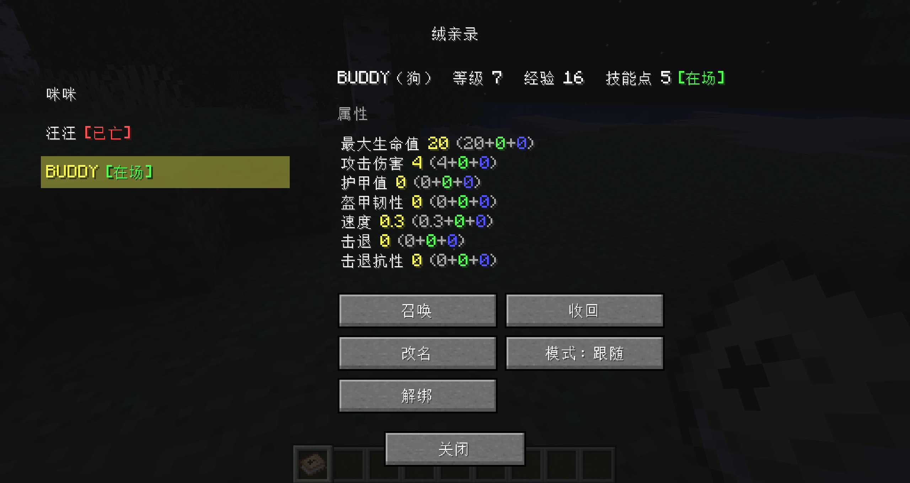
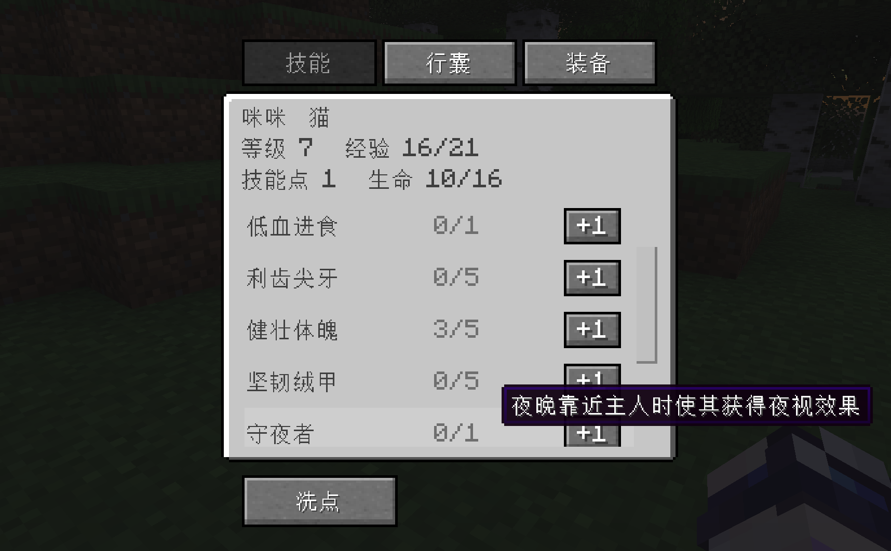
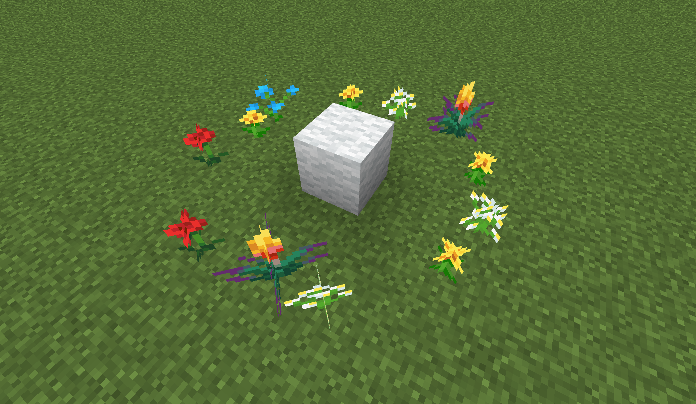

# Furkin（绒亲）

> **Minecraft 1.19.2 分支。** 此分支面向 Minecraft 1.19.2 / Forge 43.x；`main` 分支继续面向 Minecraft 1.20.1。


轻量化的**伴侣宠物框架**：把原版动物契约成有成长、有技能树、能穿装备、可复活的伴侣宠物——**绒亲**，
并开放 API 让其他模组把自己的生物也接入成为绒亲。
本包原生支持猫猫和狗狗（因为它们相当毛~绒~绒~）

> English docs: [README.md](./README.md).

---

## 特性

- **契约** — 一张道具即可契约任意**已注册**物种，无需事先驯服；目标需先满足可配置的生命值门槛。
- **技能树** — 共享主干 + 物种特色分支。
- **装备** — 对齐原版 4 槽，第三方盔甲零配置直接可穿。
- **随身行囊** — 随绒亲同行的背包，格数随 `travel_pouch` 技能等级派生，含缩容 / 回收 / 死亡掉落处理。终于有人替你搬圆石了。
- **复活** — 魂石制复活，成长不丢失。
- **跨维度随行** — 主人过门或跨维度传送时，身边默认 16 格内**已加载**的绒亲会一起到新维度；坐姿绒亲到达后起身跟随。不加载冷区宠物，半径与开关见 `furkin-server.toml`。

## 依赖

| 需求             | 版本   |
| ---------------- | ------ |
| Minecraft        | 1.19.2 |
| Minecraft Forge  | 43.2.0+ |
| Java             | 17     |

**零强制前置。** 不需要任何依赖库模组。

## 安装

1. 安装 [Minecraft Forge 1.19.2](https://files.minecraftforge.net)（43.2.0 或更高）。
2. 从 releases 下载最新 `.jar`。
3. 放入你的 `.minecraft/mods` 文件夹。

## 用法

- 用羊毛和纸制作一张**绒亲契约**，右键任意有效动物即可将其契约成绒亲。Enemy 默认需降至 30% 或 4 点生命值，NeutralMob 默认 50% 或 8 点，其他已注册物种默认不额外限制；阈值位于 `furkin-server.toml`。
- 用绒亲契约和书制作一本**绒亲录**来管理你的绒亲（召唤、收回、解绑、切换战斗模式等）。



- 通过潜行+右键点击你的绒亲，为它升级技能、调整装备。它已经准备好跟你进行一次冒险了。



- 技能加点不合心意吗？用绒亲契约和水瓶制作一瓶**洗点药水**吧。

- 当你的绒亲不慎阵亡，拾回它掉落的**绒亲魂石**，你还能将它带回人间。

- 主人跨维度时，身边已加载的绒亲会一同随行；超出半径或所在区块未加载的宠物留在原地，不会被强行加载。默认半径 16 格，可在 `furkin-server.toml` 用 `ownerDimensionFollowRadius` 调整，或用 `ownerDimensionFollowEnabled` 关闭。原版末地「终章返回」不随行。



（为此，你可能需要一个羊毛和一些花……）

## 模组开发者

Furkin 定位为**前置模组**：依赖它，通过公开 API（`com.wanancat.furkin.api`）
注册你自己的物种、技能与效果。

```java
// 注册一个物种
FurkinApi.registerSpecies(EntityType.WOLF, ...);
```

任何已注册的物种都可以——哪怕是僵尸，只要你觉得它足够毛绒绒。:)

完整 API 见 `api` 包（7 个公开类型）。
⚠️ `api` 包以外的所有类型（尤其 `internal.*`）均为内部实现，不在兼容承诺范围内、随时可能变更。

## 从源码构建

```bash
# 需要 JDK 17
./gradlew build
```

模组 jar 产物位于 `build/libs/furkin-<version>.jar`。

运行开发客户端或服务器：

```bash
./gradlew runClient
./gradlew runServer
```

## 许可证

[MIT](./LICENSE.txt)。可自由使用、修改与再分发——包括整合包和作为依赖。

## 致谢

- **作者**：wanancat
- 基于 Minecraft Forge 模组框架构建。
